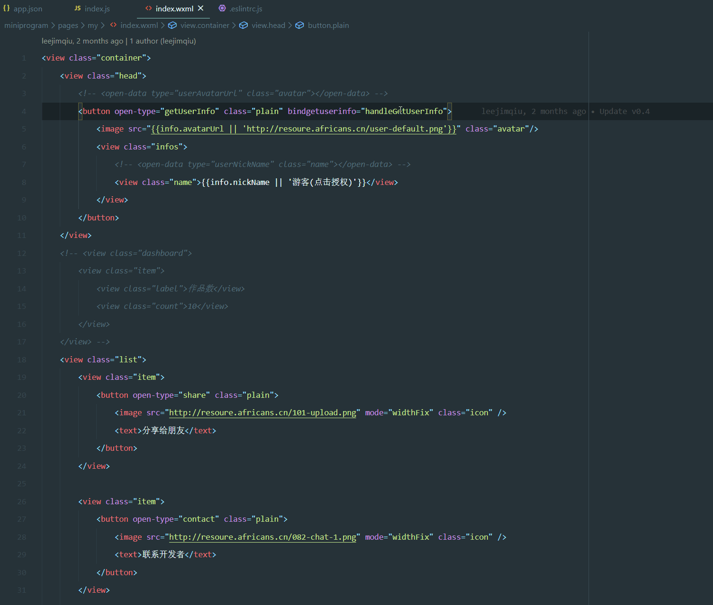

# smapp

small + app = smapp

微信小程序开发，VScode插件。提供一些日常开发需要的功能。

## 支持功能

### 智能类名提示
在`wxml`输入`class="`智能提供当前可用的所有类名
> 关联全局样式`app.wxss`和当前`wxml`对应的`wxss`

### 跳转this调用的方法定义位置

### 跳转WXML绑定的变量

## 待支持功能

- 在page输入this时，智能关联当前this指向的对象
- 增加全局对象`global`的IntelliSense

## 设置

暂无

## 更新日志

- `v0.0.1`
    - Add: 智能类名提示
    - Add: 跳转this调用的方法定义位置
- `v0.0.5` 
    - Add：跳转WXML绑定的变量